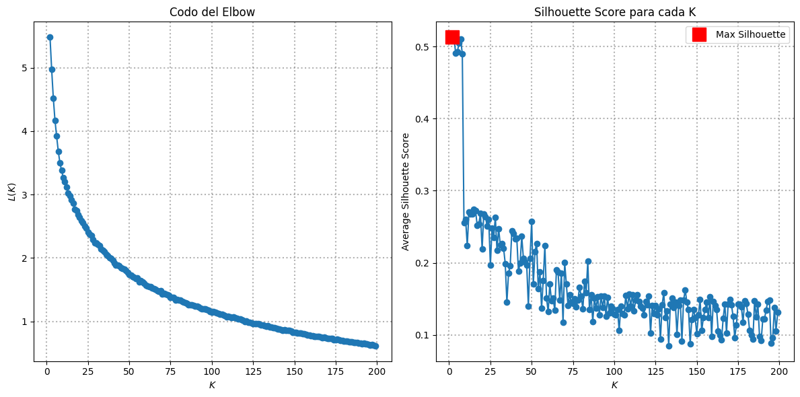

# Proyecto Final. Tratamiento de Datos. AMJ y JMIG

# **Análisis de Textos y Regresión con Modelos Transformer**

## Autores
- **Alejandro Mesquida Jiménez, 100429586**
- **José María Iranzo González, 100406233**

## Descripción General
Este proyecto se centra en el análisis y la predicción de datos utilizando diferentes métodos de representación vectorial y técnicas de modelado para problemas de regresión. Se implementaron diversas técnicas, desde el preprocesamiento de textos hasta el uso de modelos transformer para la predicción de resultados.

### Metodología Utilizada
1. **Análisis de variables de entrada**
   - Visualización a través de histogramas de la relación entre la variable `rating` y las categorías en la variable `categories`. Se ha tenido en cuenta el numero de repeticiones de categorias para despreciar las que menos apariciones tiene. Como categorias más influyentes tenemos bon_appetit y las diferentes categorias de intolerancias o minorias gastronómicas. 
   - Estos resultados tienen un sentido, en primer lugar que bon_appetit significa buen provecho en frances, lo que augura que el plato con dicha categoría tiene un buen gusto. En segundo lugar, las personas con alergias, intolerancias o que pertenecen a minorías gastronómicas valoran mejor aquellos platos que están hechos a su medida.  

2. **Implementación de un pipeline para el preprocesado de textos**
   - Uso de librerías como NLTK y SpaCy para el tokenizado, eliminación de stopwords y lematización.
   - Explicación de cómo se manejaron los textos sin preprocesar para la entrada en modelos basados en transformers.
   - Resultados del preprocesamiento y cómo afectaron las representaciones vectoriales generadas.

3. **Representación vectorial de los documentos**
   - **TF-IDF**: Implementación y resultados obtenidos con este método. Discusión sobre la importancia de las palabras clave en los documentos.
   - **Word2Vec**: Descripción de cómo se promedió los embeddings de las palabras para formar vectores de documento. Análisis de similitud entre documentos y palabras clave.
   - **Embeddings contextuales (BERT)**: Explicación del proceso de obtención de embeddings BERT y cómo se utilizaron para mejorar las representaciones de documentos. Comparación con otros métodos.

4. **Entrenamiento y evaluación de modelos de regresión**
   - Uso de redes neuronales en PyTorch para el aprendizaje automático. En concreto una red neuronal multicapa con normalización y ReLu. El modelo de vectorización se le pedirá al usuario por teclado, para facilitar su uso. 
   - Implementación de *Random Forest* en Scikit-learn para comparación con el modelo de red neuronal. Se obtienen diferentes resultados. En este caso será el usuario el que deberá cambiar los parámetros, ya que hay implementado un optimizador de hiperparámetros, que escoje los que mejor R^2 proporciona.
   - Evaluación con métricas como Loss y R^2 para determinar la efectividad de los modelos. Así como gráficas para facilitar la comprensión. Se aprecia en los resultados diferentes aspectos, por un lado, que al reducir la base de datos para hacerla más manejable, estamos reduciendo las posibilidades de que nuestro modelo mejore. Esto se ve reflejado en las métricas que tienen peores valores. Sin embargo nos damos cuenta de que BERT consigue mucho mejor resultado que los otros dos modelos de vectorización. Tanto para la red neuronal, como para el Random Forest. 

5. **Comparación de lo obtenido con el fine-tuning de un modelo preentrenado**
   - Uso de Hugging Face para ajustar un modelo transformer con una cabeza de regresión.
   - Comparación de los resultados con las técnicas anteriores y discusión sobre las mejoras obtenidas.

### Extra
- **Summarizer**: Como en el enunciado se nos indica, hemos decidido tambien extendernos haciendo un resumidor en español, *summarizer*, que nos permita reducir las extensiones de las variables textuales. En este caso y como se nos indica, lo hemos realizado para la variable `directions`. 

  Primero tomamos un número pequeño de recetas para poder manejar bien el resumidor. Concatenamos los pasos y limitamos su longitud para evitar problemas con la RAM.

  Definimos las funciones para dividir y resumir los textos. Y por último lo inicializamos.

  Los resultados son muy favorables, ya que tenemos los textos resumidos en gran medida y sin perder una gran cantidad de información. Aunque sí es verdad que hay pequeños datos que se pierden como la temperatura en algunos casos. 
- **Clustering de diferentes variables**: Uso de un algoritmo k-means para agrupar diferentes variables. Análisis de los clusters resultantes y la relevancia de estos para el problema de estudio.
- 
## Preparación de datos e importación de bibliotecas

El primer paso de nuestro proyecto es la importación de todas las librerías necesarias así como la descarga del dataset del fichero `full_format_recipes.json`. Para llevar a cabo el análisis y la implementación del proyecto, se utilizarán diversas librerías de Python, cada una con un rol específico en el proceso. Desde las herramientas para el preprocesamiento de texto como NLTK y SpaCy, hasta las librerías de modelado y representación vectorial como Gensim, PyTorch y Hugging Face.

Una vez descargado el dataset, podemos observar como contamos con cerca de 20,000 recetas. Sin embargo, a la hora de trabajar con los datos, nos dimos cuenta de que había filas enteras del dataset que estaban vacias (todos los valores eran NaN), por lo que decidimos eliminarlos. Por otro lado, trabajar con 20,000 recetas era computacionalmente muy costoso, por lo que se decidió reducir el dataset a 2,000 recetas para que fuera más manejable a la hora de entrenar las redes neuronales y los regresores a partir del paso 4.

## Análisis de las variables de entrada

En primer lugar, decidimos obtener un contador de cuantas veces aparecía cada categoría, para así poder tener esto en cuenta a la hora de analizar los datos. El análisis que decidimos llevar a cabo fue como la media de la variable 'rating' variaba en función de la categoría de la receta, pudiendo así observar que categorías son puntuadas mejor que otras. Ordenando las categorías que obtenían una mejor puntuación, obtenemos los siguientes resultados:

Sin embargo, si nos fijamos en algunas de las categorías que obtienen mejor puntuación, podemos darnos cuenta de que aparecen muy pocas veces. Por ejemplo, las categorías 'Mortar and Pestle' y '#Wastless' aparecen 2 y 1 veces respectivamente, por lo que estos datos no son muy representativos del dataset completo. Por ello, como hemos comprobado anteriormente que algunas de las categorías tienen miles de apariciones en el dataset, vamos a escoger un límite de 500 apariciones, y representar la media de los ratings solo para categorías que aparezcan más de 500 veces en el dataset.

De esta forma, obtenemos datos mucho más representativos de nuestro dataset. Por ejemplo, si observamos ahora el rating promedio de la categoría 'Bon Appétit', la cual es la que más se repite de todo el dataset, podemos observar como tiene un rating promedio de 3.893038, situándola como la categoría número 29 con mejor rating. Si ahora representamos las 20 mejores y 20 peores categorías que aparecen más de 500 veces, obtenemos los siguientes resultados:

De las categorías más positivas podemos destacar las categorías Cake, Thanksgiving, Christmas, Low Cal, Shrimp, Roast, Grill/Barbecue, Sauté, Beef, Pork, Marinate, Mixer, y Backyard BBQ.

Por un lado, las categorías Cake, Thanksgiving, Christmas y Backyard BBQ están asociadas con celebraciones especiales y eventos festivos, lo que las hace más atractivas. Las tartas y las comidas típicas de estas festividades son generalmente bien recibidas y tienen un alto índice de satisfacción, especialmente en reuniones familiares o eventos especiales, lo que podría resultar en ratings positivos.

Por otro lado, las categorías relacionadas con técnicas de cocción como Roast, Grill/Barbecue, Grill, Sauté, y Marinate son populares porque permiten resaltar sabores intensos y cocinar platos sabrosos. Estas técnicas son conocidas por producir resultados deliciosos y bien valorados, especialmente cuando se preparan carnes como Beef, Pork, o mariscos como Shrimp.

Además, las categorías Low Cal y High Fiber están ganando popularidad entre aquellos que buscan opciones más saludables y equilibradas, lo que también contribuye a ratings positivos. Las personas que siguen dietas controladas en calorías o ricas en fibra suelen valorar positivamente recetas que ofrecen beneficios para la salud sin sacrificar el sabor.

De las categorías más negativas podemos destacar las categorías Mint, Lemon, Lime, Orange, No-Cook, Sauce, Breakfast, Kid-Friendly, Party, Cocktail Party, Drink, Alcoholic y Party.

Por un lado, las categorías Mint, Lemon, Lime y Orange están relacionadas con sabores frescos y ácidos, los cuales no suelen gustar a todo el mundo, consiguiendo así ratings más bajos. Sin embargo, estos rating siguen estando entorno a 3.5, por lo que podría deberse a que algunas personas les dan un rating muy alto y otras muy bajo, quedandose la media en un punto intermedio.

Por otro lado, las categorías relacionadas con la fiesta, como pueden ser Party, Cocktail Party, Drink, Alcoholic y Party también obtienen ratings más bajos. Esto podría ser debido a factores relacionados con la salud, las preferencias dietéticas o aplicabilidad en la vida cotidiana.

Finalmente, otro punto que tienen en común todas estas categorias es que las recetas son sencillas y rápidas de hacer, por lo que parece que la mayoría prefieren recetas más elaboradas.

## Implementación de un pipeline para el preprocesado de los textos.

De la misma forma que hicimos en clase, antes de continuar con la tarea de vectorización, debemos estructurar y limpiar el texto para conservar únicamente la información que nos permita capturar el contenido semántico del corpus. Esto mejorará el resultado de nuestros embeddings.

Para este propósito, aplicaremos los siguientes cuatro pasos, que son típicos en cualquier tarea de procesamiento de lenguaje natural (NLP):

1.   Manipulación del texto (Text Wrangling)  
2.   Tokenización  
3.   Homogeneización  
4.   Limpieza  

Para los próximos pasos, utilizaremos algunos métodos disponibles en:

*   [Natural Language Toolkit (NLTK)](https://www.nltk.org/)  
*   [Beautiful Soup](https://pypi.org/project/beautifulsoup4/)  
*   [Contractions](https://pypi.org/project/contractions/)  
*   [re — Operaciones con expresiones regulares](https://docs.python.org/3/library/re.html)

Para ello, importamos todas las librerías necesarias y, para estructurar y limpiar el texto, definimos esta función, que ejecuta los 4 pasos mencionados anteriormente. En esta función, primero se eliminan urls y etiquetas html con BeautifulSoup, después se expanden las contraciones y se tokenizan las palabras y los signos de puntuación, y finalemnte se eliminan los signos de puntuación, las stopwords y se lematizan los tokens. De esta forma, conseguimos añadir una nueva columna a nuestro dataset, en la que se encuentra la receta tokenizada para cada documento. Este preprocesado se utilizará a la hora de llevar a cabo las representaciones vectoriales TF-IDF y Word2Vec, ya que para los embeddings del transformer BERT, el modelo utiliza su propio proceso de tokenización.

## Representación Vectorial

Como se mencionó anteriormente, para TF-IDF y Word2Vec se usaron las 20,000 recetas, mientras que para la representación de los embeddings contextuales con BERT se usó un dataset reducido de 2,000 recetas, yq eue este último era muy costoso computacionalmente, y obtener los embeddings de los 20,000 documentos era demasiado costoso.

En primer lugar, cabe destacar que, dado que las funciones encargadas de crear las representaciones vectoriales esperan un único texto como entrada, y nosotros tenemos una lista de pasos en cada fila de la columna 'descriptions', debemos juntar esa lista de pasos en un único texto, que será la receta completa. De esta forma, ya tenemos todo lo que necesitamos para generar las representaciones vectoriales.

### TF-IDF

TF-IDF (Term Frequency-Inverse Document Frequency) genera una representación basada en el peso de las palabras en los documentos, considerando su frecuencia relativa en el corpus. Para poder generar la representación TF-IDF de nuestras palabras, primero debemos generar una representación Bag-Of-Words, que será introducida como entrada a la función TfidfModel de Gensim. 

Para ello, en primer lugar, definimos nuestro diccionario, que contendrá todos los tokens que aparecen en nuestro corpus. Dado que en este caso estamos trabajando aún con las 20,000 recetas, obtenemos un diccionario de 9,159 tokens, y una vez que hemos definido nuestro diccionario, podemos generar nuestra representación BOW de las recetas, que no es más que contar la frecuencia con la que cada palabra aparece en una receta. Como se puede observar, los vectores contienen el identificador númerico de cada palabra con su respectiva frecuencia de aparcición en el documento.

Una vez generada nuestra representación BOW, pasamos a generar la representación TF-IDF mediante la función de la librería Gensim. De esta forma, obtenemos vectores que contienen el identificador númerico de cada palabra con su respectivo valor TF-IDF, que se basa en el peso de las palabras en los documentos, considerando su frecuencia relativa en el corpus.

Sin embargo, estos vectores tienen una longitud distinta en función del número de tokens de cada documento. Por ello, para que posteriormente nuestras redes neuronales tengan una entrada de tamaño constante, generamos el vector TF-IDF denso, que rellena con valor 0 para el resto de palabras que no aparecen en ese documento. De esta forma, conseguimos que todos los vectores TF-IDF tengan una longitud igual a la longitud del diccionario (en este caso, 9,159).

### Word2Vec

Word2Vec es un modelo que representa palabras como vectores densos en un espacio de alta dimensión, donde palabras con significados similares están cerca unas de otras. Para ello, utilizamos la función Word2Vec de Gensim, introduciendo el corpus de documentos, un tamaño de vector de 200, una ventana de 5 y un contador mínimo de 5. De esta forma, cada vector word2vec de cada palabra tendrá una longitud = 200, y para generar dicho vector el modelo considerará 5 palabras a la izquierda y 5 palabras a la derecha de la palabra objetivo para aprender relaciones contextuales. Además, solo se utilizan palabras que aparezcan más de 5 veces en nuestro corpus. Estos valores fueron elegidos basandonos en los ejemplos de los notebooks realizados en clase, pero podríamos haber elegido distintos valores de entrada para la representación Word2Vec.

Una vez que el modelo está entrenado, se puede acceder a él a través del atributo wv, que es el modelo real de vectores de palabras. Podemos ver el vocabulario aprendido por el modelo a través del diccionario key_to_index, es decir, las palabras objetivo para las cuales hemos calculado un embedding, así como los embeddings correspondientes para estas palabras. Si lo hacemos, podemos observar como, para cada palabra de cada documento, se obtiene a la salida un vector de 200 dimensiones que describe al propio token, además de al contexto en el que se encuentra.

Dado que hemos representado nuestras palabras como vectores numéricos, podemos utilizar la similitud coseno entre dos vectores de palabras para medir la similitud lingüística o semántica de las palabras correspondientes. Para ello, Gensim proporciona la función `most_similar`, que devuelve las palabras más similares a una palabra dada. Como se puede apreciar, la palabra 'pepper' parece estar muy relacionada con otras especias, mientras que la palabra 'cheese' con quesos distintos, por lo que parece que word2vec consigue vectores que se parecerán más con palabras relacionadas entre si.

También podemos verificar el rendimiento de nuestro modelo visualizando los embeddings. Sin embargo, aunque los embeddings son vectores de baja dimensionalidad, incluso 4 dimensiones son demasiadas para visualizar. t-SNE (*t-distributed Stochastic Neighbor Embedding*) resuelve este problema, ya que permite visualizar datos de alta dimensionalidad reduciéndolos a datos de dos o tres dimensiones. Esta técnica toma los embeddings (o cualquier conjunto de datos) y busca preservar, tanto como sea posible, en 2 (o 3) dimensiones las distancias del espacio original de la dimensión del embedding. Por lo tanto, esto nos ayuda a tener una idea del espacio de los embeddings de palabras.

Sklearn incluye una implementación de t-SNE que podemos usar fácilmente. Sin embargo, pasar de una representación en 200 dimensiones a una de 2 es muy complicado por lo que la figura tampoco será muy representativa en genera. A pesar de ello, podemos centrarnos en puntos especificos de la representación y analizar como, efectivamente, palabras que deberían estar relacionadas entre si aparecen juntas.

Si nos centramos en la zona (-20 , 40), vemos como muchos números, que parecen ser las enumeraciones de los pasos de la receta estan muy próximos entre si. Por otro lado, aunque tampoco se puede apreciar muy claramente, en la zona (-20 , 0) aparecen muchas palabras relacioandas con salsas, especias o condimentos que podrían ser necesarios en la receta. Sin embargo, en la mayor parte de la representación, es dificil apreciar bien las características de las palabras.

### Representación con Embeddings Contextuales (Transformers)

BERT (Bidirectional Encoder Representations from Transformers) es un modelo de lenguaje preentrenado basado en la arquitectura Transformer. Sin embargo, en este punto no estamos interesados en el modelo en si, si no en los embeddings que genera a partir de los documentos a la entrada. Para poder trabajar con BERT, en primer lugar, cargamos el modelo pre-entrenado que ya contiene un vocabulario y unos tokens específicos como diccionario.

De nuevo, dado que BERT espera un único texto como entrada, y nosotros tenemos una lista de pasos en cada fila de la columna 'descriptions', debemos juntar esa lista de pasos en un único texto, que será la receta completa. Además, para ejecutar BERT correctamente añadimos los tokens [CLS] al inicio y [SEP] al final de cada receta, de forma que el modelo sepa donde esta el inicio y el final de la receta. Por último, usamos el propio tokenizador implementado por BERT para obtener las recetas en formato token. Como se mencionó anteriormente, cabe destacar que este preprocesado es distinto al implementado anteriormente ya que BERT ejecuta su propio preprocesado, creando tokens que no aparecían en la implementación anterior, como podrái ser el caso del token '##ils'.

Por otro lado, el modelo BERT solo puede trabajar con textos que contengan como máximo 512 tokens. Por ello, es necesario truncar a 512 las recetas que contengan más de 512 tokens. Además, dado que el modelo espera entradas de la misma longitud, debemos añadir padding (el token [PAD]) a las reectas que contengan menos de 512 tokens, de forma que todas las recetas del corpus pasen a tener una longitud de 512 tokens. De esta forma, estamos perdiendo información de las recetas que son más largas, pero es la única forma de trabajar con el modelo BERT.

Una vez tenemos todos los datos de entrada con la estructura necesaria, podemos pasarlos a través del modelo. En este caso, BERT es una red neuronal profunda compuesta por 12 capas, por lo que entrenar una red tan densa será, computacionalmente, muy costoso.

Ahora, podemos pasar todos nuestros tensores al modelo para obtener la representación con embeddings contextuales. De la misma forma que se hizo en clase, en el notebook de ejemplo, representaremos estos embeddings como la suma de las últimas cuatro capas del modelo BERT, aunque se podría haber hecho de otra forma. Cabe destacar que al contar con 2000 vectores de longitud 512, el proceso fue computacionalmente muy costoso, incluso quedándonos unicamente con las últimas cuatro capas del modelo, y necesitando liberar memoria en cada iteración.

Finalmente, se consigue un tensor de tamaño 2000x512x768. 2000 representa el número de documentos en el corpus, 512 el número de tokens en cada documento, y 768 es el tamaño del vector que representa cada token de cada documento. Como se puede observar, esto resultó en un tensor extremadamente grande, pesando alrededor de 3 Gigas.

Para poder analizar los vectores generados por BERT, decidimos calcular la distancia coseno entre las palabras '30' y 'tomato' y las palabras '30' y 'minutes', que aparecen en la primera receta del corpus. De esta forma, podemos ver como los vectores de la segunda tupla de palabras son mucho más parecidos (distancia coseno = 0.62) que los de la primera (distancia coseno = 0.19), lo que quiere decir que palabras relacionadas entre ellas tienen embeddings que se parecen más entre si.

Por último, los vectores obtenido para el token inicial de cada receta [CLS], sirven como representación de la receta completa. De esta forma, dado que trabajar con una matriz de 2000x768 es mucho más sencillo que trabajar con una de 2000x512x768, optamos por trabajar en los siguientes pasos con los vectores que representan a las recetas completas, y no a los que representan individualmente a cada token de cada receta. De esta forma coginedo solo el vector para el token [CLS] de cada receta, podemos utilizar redes neuronales y regresores con entradas de longitud 768 para cada documento, en lugar de entradas de 512x768 para cada documento.

## Regresión

### Redes Neuronales

### Otra técnica implementada en la librería Scikit-learn - RandomForest

## Comparación de lo obtenido en el paso 4 con el fine-tuning de un modelo preentrenado con Hugging Face

A diferencia de en el paso 3, cuando sacabamos los embeddings de BERT, en este caso si que queremos entrenar un modelo ya existente. En nuestro caso, decidimos realizar el fine-tunning sobre el modelo BertForSequenceClassification, al cual le modificamos la capa de salida para que tenga una única salida y funcione como regresor.

En primer lugar, no dimos cuenta de que el modelo causaba errores en la ejecución porque había algunas recetas cuyo 'rating' era NaN, y dado que en los pasos anteriores habíamos trabajado con las primeras 2000 recetas, decidimos sustituir los ratings NaN por la media de los ratings del resto de recetas, y así poder seguir trabajando con las mismas 2,000 recetas. Dado que esto solo ocurría en 2 de las 2000 recetas, tampoco suponía un cambio brusco en los resultados.

Para entrenar el modelo, dividimos el conjunto de datos de 2,000 recetas en dos partes: un 80% para el conjunto de entrenamiento y un 20% para el conjunto de prueba. Finalmente, re-entrenamos el modelo, obteneindo las mismas métricas que en el apartado anterior. Sin embargo, durante el entrenamiento, no conseguimos obtener los resultados de $R^2$, RMSE y MAE para el conjunto de entrenamiento, por lo que no pudimos generar gráficas iguales a las del punto 4, si no, unicamante para el conjunto de test.

De las gráficas podemos sacar diferentes conclusiones:

1.   Las pérdidas MSE, RMSE y MAE deberían de decrecer con el número de épocas, y así ocurre, de forma que el modelo se entrena correctamente. Por otro lado, la $R^2$ debería de tender a 0 y esto también ocurre.
2.   Como se mencionó anteriormente para las redes neuronales, es probable que aumentando el tamaño del dataset, los resulatdos mejorarían, pero esto era computacionalmente muy costoso, por lo que podría ser un aspecto a mejorar si tuvieramos ordenadores más potentes.
3.   Podemos observar como las perdidas y la $R^2$ continuan teniendo oscilaciones y no terminan de converger durante el entrenamiento, por lo que entrenar durante un mayor número de épocas o modificando el learning rate podría ser beneficioso. Sin embargo, de nuevo, esto supondríatener un modelo que tardase aún más en ser entrenado, que en nuestro caso, al no contar con tiempo ilimitado con las GPUs que proporciona Google Colab de forma gratuita, no era posible.
4. Los valores, aunque lejos de ser los óptimos sí que entran dentro de márgenes aceptables, ya que conseguimos valores para las pérdidas cercanos a 0. Por ello, al introducir nuevas recetas, el modelo debería de ser capaz de acercarse al rating real con su predicción.

Por último, si ahora imprimimos los valores del rating predicho por la red y los comparamos con los ratings reales, vemos como dado que la mayoría de las etiquetas reales están entre 3.5 y 4.5, el modelo suele predecir valores en este intervalo. Sin embargo, también vemos que esto no siempre es así, ya que, para una de las recetas, la predicción ha sido 1.009 mientras que la etiqueta real: 3.750. De esta forma vemos como el modelo no parece estar demasiado sobreajustado a predecir valores entre el 3.5 y el 4.5.

Por otro lado, también vemos como es muy dificil que el modelo acierte el rating con exactitud, aunque suele tener un error menor del 0.5 en la mayoría de casos. Esto podría deberse a que los textos son complejos y es dificil intuir el rating a partir de ellos. Además, al ser un problema de regresión, el modelo aprende a dar cualquier valor entre el 0 y el 5, mientras que las etiquetas reales son valores bastante redondos. Por este motivo, se podría incluso haber modificado el modelo para, en vez de trabajar como regresor, trabajar como clasificador ajustando el número de salidas posibles de la red (por ejemplo: si los ratings solo pueden ser valores múltiplos de 0.5, habrá 10 posibles salidas).

## Extensión

### K-means

En primer lugar, decidimos probar si tendría sentido aplicar el algoritmo de K-means sobre las representaciones vectoriales obtenidas en el apartado 3. Para ello, ya que obtuvimos una representación en 2 dimensiones de cada palabra al usar t-SNE sobre la vectorización word2vec, decidimos probar si el algoritmo K-means sería capaz de encontrar parecidos entre las palabras a partir de vectores de alta dimensión (en este caso de 200 dimensiones).

Para ello, dado que el diccionario de los 20,000 documentos está compuesto de 9159 tokens distintos, se optó por utilizar un total de 100 clusters. Después, se ajusta el modelo de k-means a los vectores de word2vec para obtener estos 100 clusters y finalmente se representan en dos dimensiones utilizando t-SNE.

Como se puede observar, la representación t-SNE no es muy representativa por varios motivos. En primer lugar, pasar de 200 dimensiones a 2 es complicado, como ya se mencionó en el apartado 3.2, y por ello, se pueden sacar pocas concusiones de esta figura. Por otro lado, al al contar con 100 clusters distintos y no haber suficientes colores a la hora de hacer el plot, muchos colores se repiten, dificultando ver los distintos clusters con claridad.

Sin embargo, podemos sacar algo de información de los clusters a partir de los propios tokens que hay en cada cluster. Las palabras en cada uno de los 100 clusters se pueden observar en la ejecución del notebook, pero no han sido copiadas en este documento. En primer lugar, se puede observar como el número de tokens en cada cluster es distinto, lo que significa que hay grupos de muchas palabras con parecidos entre si otras palabras cuyos vectores no se parecen con ninguna otra palabra.

Centrandonos en clusters en concreto podemos observar:

1. Cluster 36: ['juice', 'lemon', 'peel', 'orange', 'lime']. Todas las palabras de este cluster están relacionadas con con cítricos y productos derivados de ellos, particularmente jugos y frutas.

2. Cluster 39: ['onion', 'garlic', 'vegetable', 'carrot', 'mushroom']. Estos términos definen claramente ingredientes vegetales comunes, especialmente aquellos que se utilizan frecuentemente en muchas recetas.

3. Cluster 98: ['tomato', 'leaf', 'green', 'parsley', 'chop', 'thyme', 'chile', 'cilantro', 'scallion', 'celery', 'red', 'fennel', 'bell', 'bay']. Este cluster está compuesto principalmente por ingredientes frescos, hierbas y especias que se utilizan en la cocina para añadir frescura, sabor y aroma a los platos.

De esta forma, podemos ver como muchos de los clusters si que juntan palabras con parecidos entre si, a pesar de que algunos de los clusters no sean muy representativos de ninguna temática.

Por otro lado, dado que el número de clusters se eligió a partir de ir probando variando el número, se trató de obtener el K óptimo como hicimos en clase. Para ello, definimos un rango de 2 a 200 clusters y buscamos el valor óptimo de K a partir del método del codo. Sin embargo, como se aprecia en las figuras, mientras que el Silhouette Score si que obtiene un máximo para K=2, no conseguimos obtener un Elbow óptimo, ya que el valor de Elbow sigue bajando al aumentar el número de clusters. Dado que que este código tardaba mucho tiempo de ejecución y que el valor de K=2 no iba a mostrar datos representativos, se optó por dejar el número de clusters a 100, y no tener en cuenta los resultados obtenidos aquí.

Dado que los resultados obtenidos no fueron lo suficientemente representativos, se optó por no realizar más pruebas con el algoritmo K-means, a pesar de que otra de nuestras ideas fuera aplicar K-means a los embeddings obtenidos con BERT y así poder ver que recetas se parecen más entre ellas y tratar de analiazar por qué.
